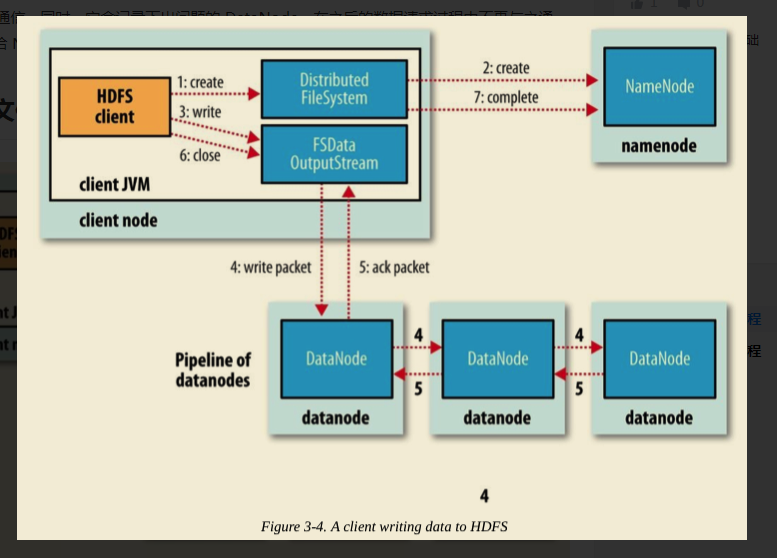
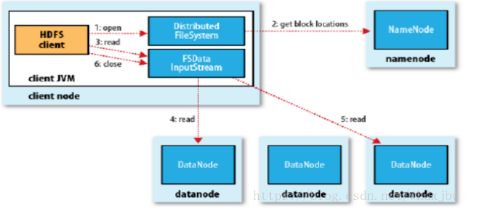

# hadoop 随笔
## 1. HDFS写文件的过程


### 1.1 步骤

- 客户端调用DistributedFileSystem的create方法
- DistributedFileSystem会向NameNode写入元数据信息，并检查输入路径，权限等问题
- DistributedFileSystem会创建输出流FSDataOutputStream；（FSDataOutputStream中包含输出流DFSOutputStream）
- 客户端向FSDataOutputStream中写入数据
```
FSDataOutputStream实际是调用DFSOutputStream的write方法写数据，包括以下几步
-将客户端提交的数据切分成Packets，并保存在DataQueue中
-DataStreamer想NameNode请求DataNode列表，将Packets写入DataNode中；假设设置的副本数为3，NameNode会将3个DataNode串成一条
 Pipeline，DataStreamer将Packets写入DataNode1中，接着就将Packets写入DataNode2，DataNode3
-当DataNode写完数据后，会返回确认信息
```
- 关闭数据流
- 发送完成信号给NameNode

### 2. HDFS读文件过程



### 2.1 步骤

- 客户端发起请求，NameNode返回输入流
- 读取数据
- 关闭数据流