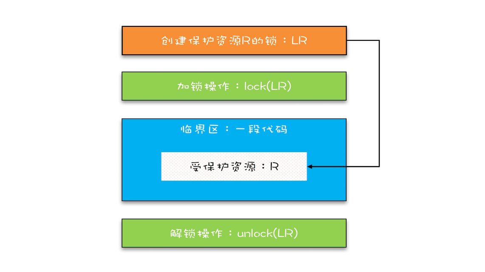
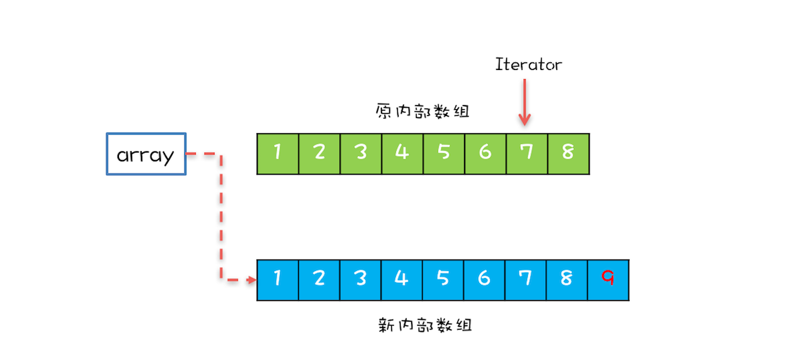

# Java并发编程实战

## 1.学习攻略

> 跳出来，看全局；钻进去，看本质


## 2.可见性，原子性和有序性问题

### 2.1 缓存导致可见性问题

> CPU缓存和内存的区别：CPU缓存不存在于内存中，是一块比内存更小，读写更快的芯片

由于多核缓存的存在（缓存：为了均衡CPU和内存之间的速度差异）。

当一个CPU时，缓存中变量的改变对其他线程时可见的，不存在这个问题；


但是，当多个线程在多个CPU上运行时，各个CPU缓存中的变量是不可见的，就会导致出错如图。


### 2.2 线程切换带来原子性问题

> 一个或多个操作在CPU执行的过程中不被中断的特性叫做原子性

例如：count+=1


### 2.3 编译优化带来有序性问题

例如：常规的单例模式

```java
public class Singleton {
  static Singleton instance;
  static Singleton getInstance(){
    if (instance == null) {
      synchronized(Singleton.class) {
        if (instance == null)
          instance = new Singleton();
        }
    }
    return instance;
  }
}
```

这里的new操作包括：

- 分配一块内存M；
- 在内存M上初始化Simgleton对象
- M的地址赋给instance变量

但是编译优化后的执行顺序是：

- 分配一块内存M；
- M的地址赋给instance变量
- 在内存M上初始化Simgleton对象

优化后可能导致的执行顺序如下：


ps：

- 上诉单例双重锁导致的问题，可以对instance变量增加volatile语意生命，禁止重排序
- 对于有volatile声明的变量，线程A执行完后会强制将值刷到内存中，线程B执行的时候，会强制将值加载到缓存中；这里涉及到`happens-before`问题

## 3.Java内存模型

> 解决可见性和有序性问题

### 3.1 Happens-Before规则

> 含义：***前一个操作的结果对后续操作是可见的***

- 程序的顺序性规则

  在一个线程中，按照程序顺序，前面的操作Happens-Before于后续的操作

- volatile变量规则

  一个volatile变量的写操作，Happend-Before于对这个变量的读操作

- 传递性

  如果A Happens-Before B，B Happens-Before C，那么A Happens-Before C

- 管程中锁的规则

  对一个锁的解锁Happens-Before于后续对这个锁的加锁

- 线程start()规则

  如果线程A调用线程B的start()方法，那么该start()操作Happens-Before于线程B中的任意操作

- 线程join()规则

  如果线程A中调用线程B的join()方法并成功返回，那么线程B中的任意操作Happens-Before于该join()操作的返回

ps：有一个共享变量abc，在一个线程里设置了abc=3，有哪些方法可以使其他线程看到abc=3（题目可以引申为：如何保证一个共享变量的可见性）

- 将变量使用volatile修饰即可
- 设置变量为private，提供get/set方法，并用synchronized对方法加锁；既保证的可见性，有保证了线程安全
- 使用原子变量，例如：Atomiclnteger

## 4.互斥锁

> 解决原子性问题

*临界区：一段需要互斥执行的代码*

### 4.1 改进后的锁模型



- 哪些东西可以作为锁？
- 受保护资源和锁的关系？【见下一节】

### 4.2 synchronized

```java
class X {
  // 修饰非静态方法
  synchronized void foo() {
    // 临界区
  }
  // 修饰静态方法
  synchronized static void bar() {
    // 临界区
  }
  // 修饰代码块
  Object obj = new Object()；
  void baz() {
    synchronized(obj) {
      // 临界区
    }
  }
}  
```

当synchornized修饰静态方法时，锁定的是当前类的class对象

当synchronized修饰非静态方法时，锁定的是当前实例对象this

上诉例子相当于：

```java
class X {
  // 修饰非静态方法
  synchronized(this) void foo() {
    // 临界区
  }
  // 修饰静态方法
  synchronized(X.class) static void bar() {
    // 临界区
  }
  // 修饰代码块
  Object obj = new Object()；
  void baz() {
    synchronized(obj) {
      // 临界区
    }
  }
}  
```

### 4.3 锁和受保护资源的关系

> ***受保护资源和锁之间的关联关系是N：1的关系，可以一个锁保护多个资源，但不能多个锁保护一个资源***

下面代码中会存在并发问题

```java
class SafeCalc {
  static long value = 0L;
  synchronized long get() {
    return value;
  }
  synchronized static void addOne() {
    value += 1;
  }
}
```

代码中的value被两个锁保护，分别是this和SafeCalc.class。由于get()使用this锁保护，addOne()使用SafeCalc锁保护，所以这两个临界区是互斥关系，两个临界区对value的修改没有可见性保证，这就导致了并发问题。锁模型如下：


### 4.4 一把锁保护多个资源可能存在的问题

如果受保护的多个资源存在关联关系，就可能出错。如下：

```java
class Account {
  private int balance;
  // 转账
  synchronized void transfer(
      Account target, int amt){
    if (this.balance > amt) {
      this.balance -= amt;
      target.balance += amt;
    }
  } 
}
```

上诉示例中，this锁只能保护this.balance不能保护target.balance。如下图，this不能保护target.balance


进一步，如果A给B转账100，B给C转账100。可能最后输出的是A：100，B：100，C：300；如下图所示


*ps：1⃣️如果将transfer加static，就相当于一当前对象的类作为锁，与下面正确的姿势就保持一致了；但这样的话，还需要对私有对象加static，但这里其实不需要静态方法；*

*2⃣️接1⃣️为什么下面的示例中的锁不在方法名上加而是在方法体中加？*

### 4.5 正确使用锁的姿势

- 资源没有关联关系时，使用不同的锁对受保护资源进行精细化管理。这种锁叫细粒度锁

- 多个受保护资源有关联关系，使用共享锁。

  1⃣️使用私有对象作为锁，私有对象需要在构造函数时传入

  ```java
  class Account {
    private Object lock；
    private int balance;
    private Account();
    // 创建 Account 时传入同一个 lock 对象
    public Account(Object lock) {
      this.lock = lock;
    } 
    // 转账
    void transfer(Account target, int amt){
      // 此处检查所有对象共享的锁
      synchronized(lock) {
        if (this.balance > amt) {
          this.balance -= amt;
          target.balance += amt;
        }
      }
    }
  }
  ```

  2⃣️使用当前对象.class作为锁

  ```java
  class Account {
    private int balance;
    // 转账
    void transfer(Account target, int amt) {
      synchronized(Account.class) {
        if (this.balance > amt) {
          this.balance -= amt;
          target.balance += amt;
        }
      }
    } 
  }
  -----------------下面是思考对比-------------------
  class Account {
    private ststic int balance;
    // 转账
    synchronized static void transfer(Account target, int amt) {
        if (this.balance > amt) {
          this.balance -= amt;
          target.balance += amt;
        }
    } 
  }
  ```

  **二者区别：**

  - 使用对象时，要求传入的时同一个对象，否则会出现锁自家门保护他家资产的事
  - 使用类的话，因为1⃣️当前类对所有当前对象是共享的2⃣️这个对象是Java虚拟机在加载类的时候创建，不需担心唯一性（*这个是什么意思？*）3⃣️无需在创建对象的时候传入，代码更简单
  - 使用类存在问题，A转账B，C转账D，不能并行了，需要优化？

  使用类做锁的示意图如下：

  

***注意事项：***

***1⃣️不能使用变量做锁***

***2⃣️互斥锁最好加final，只是最佳实践***

## 5.死锁

> 定义：一组互相竞争资源的线程相互等待，导致"永久"阻塞的现象

示例：

```java
class Account {
  private int balance;
  // 转账
  void transfer(Account target, int amt) {
    // 锁定转出账户
    synchronized(this) {
      //锁定转入账户
      synchronized(target) {
        // 转账
        if (this.balance > amt) {
          this.balance -= amt;
          target.balance += amt;
        }
      }
    }
  }
}
```

示例代码会导致死锁，如下图所示


**疑问**：线程T1占有账户B，但如果线程T1没有占有账户A的话，怎么占有账户B？于代码来说就是：还没有获取this锁，怎么获取target锁？如果this锁没有释放，就无法获取target锁？

### 5.1 如何规避死锁

Coffman的牛人提出，只有下面四个条件都发生时才会出现死锁：

- 互斥，共享资源X和Y只能被一个线程占有
- 占有且等待，线程T1已经取得共享资源X，在等待共享资源Y的时候，不释放共享资源X
- 不可抢占，其他线程不能强行抢占线程T1占有的资源
- 循环等待，线程T1等待线程T2占有的资源，线程T2等待线程T1占有的资源，就是循环等待

***反过来，如果破坏其中一个，就能避免死锁***

## 6.等待-通知机制

使用synchronized，wait()，notify()，notifyAll()来实现

- wait，notify，notifyAll方法操作的等待队列是互斥锁的等待队列，所以如果synchornized锁定的是this，那么对应的是this.wati(), this.notify(), this.notifyAll()
- 使用这三个方法的前提是获取锁，所以这些方法都在synchronized内部调用
- 如果在synchronized外部调用的，或不是调用的对应的锁，JVM运行时会抛出异常：`java.lang.IllegalMonitorStateException`
- 尽量使用notifyAll()，因为使用norify()可能导致默写线程永远不会被唤醒

ps：wait()和sleep()都会时线程等待一段时间，有什么区别？

wait()会释放对象的`锁标志`，但是sleep不会；如果有synchronized同步块，其他线程仍然不能访问共享资源

## 7.安全性，活跃性以及性能问题

### 7.1 安全性问题

*问：什么时安全性问题？* 

*答：安全性问题就是正确性问题，程序没有按照我们期待的方案执行。*

*问：为什么会存在安全性问题？*

*答：因为可见性，原子性和有序性问题*

*问：在实际编写多线程的代码，什么时候需要分析这些问题？*

*答：存在共享数据且数据会发生变化，通俗的讲就是多个线程同时读写同一份数据*

**数据竞争**

**竞态条件：**程序执行的结果依赖线程执行的顺序

举例：

```java
public class Test {
  private long count = 0;
  synchronized long get(){
    return count；
  }
  synchronized void set(long v){
    count = v;
  } 
  void add10K() {
    int idx = 0;
    while(idx++ < 10000) {
      set(get()+1)      
    }
  }
}
```

如上面例子，如果有两个线程同时调用一次add10k方法，我们期待的结果是2，但返回结果是一，因为写的时侯后一个把前一个线程的值覆盖了。

可以总结如下

```java
if (状态变量  满足  执行条件) {
  执行操作
}
```

当某个线程发现状态变量满足条件时，开始执行操作；可在执行操作的时侯，其他线程修改了状态变量，导致状态变量不满足执行条件。很多场景下这个条件是隐式的，如上例中的set(get() + 1)。

**解决方案：**`锁`

### 7.2 活跃性问题

*问：什么是活跃性问题？*

答：指某个操作无法执行下去

*问：常见的问题？*

*答：死锁，活锁，饥饿*

#### 7.2.1 活锁

> 有的线程虽然没有发生阻塞，但也会存在执行不下去的情况。因为都互相谦让

**解决方案：**等待一个随机时间

#### 7.2.2 饥饿

> 线程因无法访问所需资源而无法执行下去的情况

**原因**

- 资源不足
- CPU繁忙时，优先级低的线程得到资源的机会低
- 执行时间过长

**解决方案**

- 保证资源充足
- 平均分配资源
- 缩短线程执行时间

方案一和方案三都是不可避免的，所以解决饥饿问题主要采用方案二，这个就是`公平锁`

### 7.3 性能问题

阿姆达尔定律（代表处理器并行计算后效率提升的能力）：


p表示并性比，n代表CPU数，1-p就是串行比，当串行比为5%，n无限大时，性能就是20倍

**如何解决性能问题**

- 使用无所得算法和数据结构
  - 线程本地存储（Thread Local Storage，TLS），写入时复制（Copy-on-write），乐观锁等
  - Java并发包中的原子类也是无锁的数据结构
  - Disruptor是一个无所得内存队列，性能非常好
- 减少只有锁的时间
  - 使用细粒度锁，如Java并发包中的ConcurrentHashMap，采用的是分段锁的技术
  - 使用读写锁，读的时侯无锁，写的时侯互斥

**性能度量的三个指标**

- 吞度量：单位时间内所能处理的请求数量

- 延迟：从请求到收到响应的时间
- 并发量：能同时处理的请求数量，一般并发量增高，延迟也会增大

## 8. 管程模型

> 管理共享变量和对共享变量的操作过程

### MESA模型

> ps：共有三种模型：Hasen模型，Hoare模型，MESA模型

并发解决的是互斥和同步两个问题

**MESA模型-互斥**

每个变量都有一个入队和出队操作，如果保证入队和出队是互斥的，那对变量的操作就是互斥的。如下图


**MESA模型-同步**

在共享变量下增加一个条件变量，同时条件变量有一个自己的队列，当不满足条件变量的话，线程进入条件变量的等待队列。当条件满足时，条件变量队列中的线程重新进入共享变量的入口等待队列。如下图：


## 9. 线程的生命周期

通用的线程周期，包含5部分：新建，可运行，运行，等待，终止。如下图


Java的线程周期，包含6部分：新建（NEW），运行/可运行（RUNNING），阻塞（BLOCKED），无时限等待（WAITING），有时限等待（TIMED_WAITING），终止（TERMINATED）。如下图：


### 线程状态转化

- NEW转为RUNNABLE

  新建线程，调用Thread.start()方法启动线程

  新建线程有两种方法，一种是继承Thread类，重写run()方法；另一种是实现Runnable，重写run()方法。示例代码如下：

  - 继承Thread

  ```java
  // 自定义线程对象
  class MyThread extends Thread {
    public void run() {
      // 线程需要执行的代码
      ......
    }
  }
  // 创建线程对象
  MyThread myThread = new MyThread();
  ```

  - 实现Runnable

  ```java
  // 实现 Runnable 接口
  class Runner implements Runnable {
    @Override
    public void run() {
      // 线程需要执行的代码
      ......
    }
  }
  // 创建线程对象
  Thread thread = new Thread(new Runner());
  ```

  然后启动线程即可，代码如下：

  ```java
  MyThread myThread = new MyThread();
  // 从 NEW 状态转换到 RUNNABLE 状态
  myThread.start()；
  ```

- RUNNABLE转为BLOCKED

  只有一种情况，就是线程扽带synchronized的隐式锁。synchronized修饰的方法或代码块同一时刻只允许一个线程执行，其他线程等待，这样，等待的线程就会进入BLOCKED状态。当线程获得隐式锁的时侯，又会从BLOCKED转为BUNNABLE

- RUNNABLE转为WAITING

  - wait()方法的调用
  - 调用无参Thread.join()。如果一个线程B调用A线程的join()，【这时线程B进入WAITING状态】线程B就需要等待A线程执行结束才能继续执行【这时线程B进入RUNNABLE状态】
  - 调用LockSupport.park()，当前线程会阻塞，线程进入WAITING状态；调用LockSupport.unpark(Thread thread)可唤醒线程，进入RUNNABLE状态

- RUNNING转为TIMED_WAITING

  - 调用**带超时参数**的 Thread.sleep(long millis)方法；
  - 获取synchronized隐式锁的线程，调用**带超时参数**的Object.wait(long timeout)方法；
  - 调用**带超时参数**的Thread.join(long timeout)方法；
  - 调用**带超时参数**的LockSupport.parkNanos(Object blocker, long deadline)方法；
  - 调用带超时参数的LockSupport.parkUntil(long deadline)方法。

- RUNNABLE转为TERMINATED

  调用stop()或者interrupt()

  stop已经被舍弃，二者又什么区别？

  - stop会真的杀死线程，如果线程持有ReentranLock锁，被stop杀死的线程不会释放ReentranLock锁

  - interrupt只是通知线程，线程有机会执行后续的操作，也可无视这个通知。被interrupt的线程怎么收到通知呢？一种是异常，一种是主动检测

    ```ruby
    - 当线程A处于BLOCKED，WAITING，TIMED_WAITING状态时，如果线程B调用线程A的interrupt方法，线程A会   转为RUNNABLE状态，并抛出InterruptedException。
    - 当线程A处于RUNNABLE状态时，并阻塞在java.nio.channels.InterruptiblleChannel时，其他线程调用   线程A会触发java.nio.channels.ClosedByInterruptException;如果阻塞在                       java.nio.channels.Selector,会立即返回
    - 调用线程A的isInterrupted()方法检测
    ```

## 10. 创建多少线程合适？

**单核**

```ruby
最佳线程数 = 1 + （I/O耗时/CPU耗时）
```

**多核**

```ruby
最佳线程数 = CPU核数 * [1 + （I/O耗时/CPU耗时）]
```

## 11. 为什么局部变量是线程安全的？

这里的局部变量值的是方法内的局部变量，如下例：

```java
// 返回斐波那契数列
int[] fibonacci(int n) {
  // 创建结果数组
  int[] r = new int[n];
  // 初始化第一、第二个数
  r[0] = r[1] = 1;  // ①
  // 计算 2..n
  for(int i = 2; i < n; i++) {
      r[i] = r[i-2] + r[i-1];
  }
  return r;
}
```

①这个操作，为什么是线程安全的？

答：1⃣️局部变量和方法是绑定在一起的，2⃣️每个方法都会有一个自己的**调用栈**，**局部变量**存放在**调用栈**里；3⃣️每个线程又有自己独立的**调用站**。所以，局部变量就不是**共享的**，没有共享就不存在线程安全的问题了

## 12. Lock：并发包中管程互斥的实现

### 12.1 再造管程的理由

`synchronized`和`Lock`的区别：synchronized如果没有获取到资源就会进入阻塞，并且不释放占有的资源，而Lock支持释放资源，提供了以下三种方法：

```java
// 支持中断的 API
void lockInterruptibly() 
  throws InterruptedException;
// 支持超时的 API
boolean tryLock(long time, TimeUnit unit) 
  throws InterruptedException;
// 支持非阻塞获取锁的 API
boolean tryLock();
```

对比synchronized的优点：

- **能够相应中断：**如果阻塞的线程能够相应中断信号的话，就可以释放占有的资源
- **支持超时：**一段时间内没获取锁，就有机会释放已占有的资源
- **非阻塞获取锁：**获取锁失败不是阻塞，而是返回，就有机会释放已占有的资源

以上三种都可以破坏死锁四个条件中的不可抢占条件，从而破坏死锁。

下面的例子中，使用了tryLock()，是否会出现死锁

```java
class Account {
  private int balance;
  private final Lock lock
          = new ReentrantLock();
  // 转账
  void transfer(Account tar, int amt){
    while (true) {
      if(this.lock.tryLock()) {
        try {
          if (tar.lock.tryLock()) {
            try {
              this.balance -= amt;
              tar.balance += amt;
            } finally {
              tar.lock.unlock();
            }
          }//if
        } finally {
          this.lock.unlock();
        }
      }//if
    }//while
  }//transfer
}
```

答：不会出现死锁，但会出现活锁。调用Lock的tryLock()方法，破坏了不可抢占条件，但是因为两个锁来回调用会出现互相谦让的情况，导致活锁。

### 12.2 Lock如何保证可见性

> 利用了volatile相关的Happens-Before原则

Lock可见性实现代码简化如下：

```java
class SampleLock {
  volatile int state;
  // 加锁
  lock() {
    // 省略代码无数
    state = 1;
  }
  // 解锁
  unlock() {
    // 省略代码无数
    state = 0;
  }
}
```

举例：

```java
class X {
  private final Lock rtl =
、  new ReentrantLock();
  int value;
  public void addOne() {
    // 获取锁
    rtl.lock();  
    try {
      value+=1;
    } finally {
      // 保证锁能释放
      rtl.unlock();
    }
  }
}
```

相关的Happens-Before原则：

- 顺序性原则：对于线程A，value += 1Happens-Before释放锁的操作unlock()
- volatile变量原则：因为Lock中的state会先读取state，线程A的unlock()操作Happens-Before线程B的lock()操做；ps：lock()方法也有state的读和写操作，为什么是unlock()先于lock()？
- 传递性原则：线程A的value += 1操作Happens-Before想程B的lock操作

### 12.3 可重入锁

> 线程可以重复获取同一把锁

如下示例：

```java
class X {
  private final Lock rtl =
、  new ReentrantLock();
  int value;
  public int get() {
    // 获取锁
    rtl.lock();         ②
    try {
      return value;
    } finally {
      // 保证锁能释放
      rtl.unlock();
    }
  }
  public void addOne() {
    // 获取锁
    rtl.lock();  
    try {
      value = 1 + get(); ①
    } finally {
      // 保证锁能释放
      rtl.unlock();
    }
  }
}
```

当线程A执行到①时，调用get()方法，会在②时再次加锁，如果rtl时可重入锁，就会加锁成功，否则会进入阻塞

**可重入方法：**多个线程可以同时调用。意味着可重入函数是线程安全的

### 12.4 公平锁和非公平锁

基于ReentrantLock示例：

```java
// 无参构造函数：默认非公平锁
public ReentrantLock() {
    sync = new NonfairSync();
}
// 根据公平策略参数创建锁
public ReentrantLock(boolean fair){
    sync = fair ? new FairSync() 
                : new NonfairSync();
}
```

公平锁的线程唤醒策略：谁等待时间长，唤醒谁

### 12.5 用锁的最佳时间

- 永远只在更新对象的成员变量时加锁
- 永远只在访问可变的成员变量时加锁
- 永远不在调用其他对象的方法时加锁

## 13. Condition：并发包中管程同步的实现

> Condition实现了管程模型中的条件变量

## 14. Semaphore：如何快速实现一个限流器

> Semaphore：信号量

### 14.1 信号量模型

> 一个计数器，一个队列，三个方法

如图：


方法功能如下代码所示：

```java
class Semaphore{
  // 计数器
  int count;
  // 等待队列
  Queue queue;
  // 初始化操作
  Semaphore(int c){
    this.count=c;
  }
  // Java代码中的acquire()
  void down(){
    this.count--;
    if(this.count<0){
      // 将当前线程插入等待队列
      // 阻塞当前线程
    }
  }
  // Java代码中的release()
  void up(){
    this.count++;
    if(this.count<=0) {  //这里不应该是this.count>0,因为如果count>0就不会有阻塞的线程，只有                  count<=0,才表示有阻塞的线程
      // 移除等待队列中的某个线程 T
      // 唤醒线程 T
    }
  }
}
```

Ps：down()和up()历史上最早被称作P操作和V操作，所以信号量模型又被叫做PV原语

### 14.2 信号量的使用

在临界区开始前获取锁，在临界区结束后释放锁。如下代码所示：

```java
static int count;
// 初始化信号量
static final Semaphore s 
    = new Semaphore(1);
// 用信号量保证互斥    
static void addOne() {
  s.acquire();
  try {
    count+=1;
  } finally {
    s.release();
  }
}
```

### 14.3 快速实现一个限流器

信号量相比Lock的优点：***Semaphore可以允许多个线程访问一个临界区***

> 限流：不允许N个线程同时进入临界区

将状态为设为N就可以了

```java
class ObjPool<T, R> {
  final List<T> pool;
  // 用信号量实现限流器
  final Semaphore sem;
  // 构造函数
  ObjPool(int size, T t){
    pool = new Vector<T>(){};
    for(int i=0; i<size; i++){
      pool.add(t);
    }
    sem = new Semaphore(size);
  }
  // 利用对象池的对象，调用 func
  R exec(Function<T,R> func) {
    T t = null;
    sem.acquire();
    try {
      t = pool.remove(0);
      return func.apply(t);
    } finally {
      pool.add(t);
      sem.release();
    }
  }
}
// 创建对象池
ObjPool<Long, String> pool = 
  new ObjPool<Long, String>(10, 2);
// 通过对象池获取 t，之后执行  
pool.exec(t -> {
    System.out.println(t);
    return t.toString();
});
```

## 15. 读写锁：如何快速实现一个完备的缓存

### 15.1 什么是读写锁

三个基本原则：

- 允许多个线程同时读共享变量
- 只允许一个线程写共享变量
- 如果一个写线程正在执行，此时禁止线程读共享变量

### 15.2 缓存的按需加载

如图：


代码如下：

```java
class Cache<K,V> {
  final Map<K, V> m =
    new HashMap<>();
  final ReadWriteLock rwl = 
    new ReentrantReadWriteLock();
  final Lock r = rwl.readLock();
  final Lock w = rwl.writeLock();
 
  V get(K key) {
    V v = null;
    // 读缓存
    r.lock();         ①
    try {
      v = m.get(key); ②
    } finally{
      r.unlock();     ③
    }
    // 缓存中存在，返回
    if(v != null) {   ④
      return v;
    }  
    // 缓存中不存在，查询数据库
    w.lock();         ⑤
    try {
      // 再次验证
      // 其他线程可能已经查询过数据库
      v = m.get(key); ⑥
      if(v == null){  ⑦
        // 查询数据库
        v= 省略代码无数
        m.put(key, v);
      }
    } finally{
      w.unlock();
    }
    return v; 
  }
}
```

当T1，T2，T3都执行到⑤时，假设T1获取的写锁，然后读数据库，获取值，当T2，T3执行到⑦时，就不需要重复连数据库了

### 15.3 读写锁的降锁

> 降锁：在获取写锁之后，再获取读锁，然后释放写锁

*在ReentrantReadWriteLock中不支持升锁，支持将锁*

降锁过程如下：

```java
class CachedData {
  Object data;
  volatile boolean cacheValid;
  final ReadWriteLock rwl =
    new ReentrantReadWriteLock();
  // 读锁  
  final Lock r = rwl.readLock();
  // 写锁
  final Lock w = rwl.writeLock();
  
  void processCachedData() {
    // 获取读锁
    r.lock();
    if (!cacheValid) {
      // 释放读锁，因为不允许读锁的升级
      r.unlock();
      // 获取写锁
      w.lock();
      try {
        // 再次检查状态  
        if (!cacheValid) {
          data = ...
          cacheValid = true;
        }
        // 释放写锁前，降级为读锁
        // 降级是可以的
        r.lock(); ①
      } finally {
        // 释放写锁
        w.unlock(); 
      }
    }
    // 此处仍然持有读锁
    try {use(data);} 
    finally {r.unlock();}
  }
}
```

## 16. StampedLock

> Java1.8中比ReentrantReadWriteLock更好的锁

### 16.1 StampedLock支持的三种模式

***写锁，悲观读锁和乐观读***

写锁和悲观读锁的语意和ReadWriteLock类似：允许多个线程获取悲观读锁，只允许一个线程获取写锁，写锁和悲观读锁是互斥的；不同的是，StampedLock的写锁和悲观读锁的获取会返回一个stamp值，释放的时候需要传入这个stamp值。相关示例代码如下：

```java
final StampedLock sl = 
  new StampedLock();
  
// 获取 / 释放悲观读锁示意代码
long stamp = sl.readLock();
try {
  // 省略业务相关代码
} finally {
  sl.unlockRead(stamp);
}

// 获取 / 释放写锁示意代码
long stamp = sl.writeLock();
try {
  // 省略业务相关代码
} finally {
  sl.unlockWrite(stamp);
}
```

ReadWriteLock多个线程同时读的时候，所有的写操作是被阻塞的；但是StampedLock的乐观读**允许一个线程获取写锁**，不是所有的写操作都被阻塞

这里说的是乐观读不是乐观读锁，**乐观读是无锁的**

官方示例简化版：

```java
class Point {
  private int x, y;
  final StampedLock sl = 
    new StampedLock();
  // 计算到原点的距离  
  int distanceFromOrigin() {
    // 乐观读
    long stamp = 
      sl.tryOptimisticRead();
    // 读入局部变量，
    // 读的过程数据可能被修改
    int curX = x, curY = y;
    // 判断执行读操作期间，
    // 是否存在写操作，如果存在，
    // 则 sl.validate 返回 false
    if (!sl.validate(stamp)){
      // 升级为悲观读锁
      stamp = sl.readLock();
      try {
        curX = x;
        curY = y;
      } finally {
        // 释放悲观读锁
        sl.unlockRead(stamp);
      }
    }
    return Math.sqrt(
      curX * curX + curY * curY);
  }
}
```

- 这里乐观读获取到共享变量后，需要用validate验证一下是否存在写操作，如果存在，需要升级为悲观读锁

### 16.2 乐观读

- 可以对比数据库的乐观锁
- stamp相当于一个验证的状态位，在乐观读的时候获取到当前的状态位，在validate验证的时候判断这个状态位是否被改变，如果没有，说明没有写操作

### 16.3 注意事项

- StamptedLock的功能是ReadWriteLock的子集
- StampedLock不支持重入
- StampedLock的写锁、悲观读锁不支持条件变量（Condition）
- 使用StampedLock一定不要使用中断操作，这样会是使CPU飙升至100%；如果需要中断，使用可中断的悲观读锁readLockInterruptibly()和写锁writeLockInterruptibly()

读模版：

```java
final StampedLock sl = 
  new StampedLock();

// 乐观读
long stamp = 
  sl.tryOptimisticRead();
// 读入方法局部变量
......
// 校验 stamp
if (!sl.validate(stamp)){
  // 升级为悲观读锁
  stamp = sl.readLock();
  try {
    // 读入方法局部变量
    .....
  } finally {
    // 释放悲观读锁
    sl.unlockRead(stamp);
  }
}
// 使用方法局部变量执行业务操作
......
```

写模版：

```java
long stamp = sl.writeLock();
try {
  // 写共享变量
  ......
} finally {
  sl.unlockWrite(stamp);
}
```

## 17. 线程同步工具类

### 17.1 CountDownLatch

> 主要解决一个线程等待多个线程的场景

- 内置计数器，当调用countDown()的时候，计数器减一
- await()，等待计数器等于0，继续执行

下面示例中，步骤一和步骤二可以并行执行，步骤三和步骤四等待步骤一和二执行结束，继续执行

模拟订单核对系统，如下图


对应代码：

```java
// 创建 2 个线程的线程池
Executor executor = 
  Executors.newFixedThreadPool(2);
while(存在未对账订单){
  // 计数器初始化为 2
  CountDownLatch latch = 
    new CountDownLatch(2);
  // 查询未对账订单
  executor.execute(()-> {
    pos = getPOrders();
    latch.countDown();
  });
  // 查询派送单
  executor.execute(()-> {
    dos = getDOrders();
    latch.countDown();
  });
  
  // 等待两个查询操作结束
  latch.await();
  
  // 执行对账操作
  diff = check(pos, dos);
  // 差异写入差异库
  save(diff);
}
```

### 17.2 CyclicBarrier

> 用于一组线程之间相互等待的场景

- 内置计数器，每次调用await，计数器减一
- 当计数器减为0时，执行线程，同时计数器重置为初始值


步骤C、D在执行的时候，A、B可以开始了

```java
// 订单队列
Vector<P> pos;
// 派送单队列
Vector<D> dos;
// 执行回调的线程池 
Executor executor = 
  Executors.newFixedThreadPool(1);
final CyclicBarrier barrier =
  new CyclicBarrier(2, ()->{
    executor.execute(()->check());
  });
  
void check(){
  P p = pos.remove(0);
  D d = dos.remove(0);
  // 执行对账操作
  diff = check(p, d);
  // 差异写入差异库
  save(diff);
}
  
void checkAll(){
  // 循环查询订单库
  Thread T1 = new Thread(()->{
    while(存在未对账订单){
      // 查询订单库
      pos.add(getPOrders());
      // 等待
      barrier.await();
    }
  });
  T1.start();  
  // 循环查询运单库
  Thread T2 = new Thread(()->{
    while(存在未对账订单){
      // 查询运单库
      dos.add(getDOrders());
      // 等待
      barrier.await();
    }
  });
  T2.start();
}
```

## 18. 并发容器

### 18.1 同步容器

> JDK1.5以前的线程安全的容器叫做同步容器

- 很多容器不是线程安全的，如：ArrayList，HashMap等
- 如果要实现线程安全，就需要加锁，例如在方法上加synchronized
- Collections中封装了一套完本的包装类，如：`Collections.synchronizedList(new ArrayList<>())`
- 组合操作会导致竞态条件
- 包装类的公共方法锁的对象都是对象的this
- 除了包装类，同步容器还有：Vector，Stack，HashTable

### 18.2 并发容器介绍

> 主要涵盖Map，List，Set和Queue


#### 18.2.1 List

> 只有一个CopyOnWriteArrayList

就是在写的时候将共享变量复制一份，这样读操作时完全无锁的。原理如下图，内部维护了一个数组


有写操作值的结构



**注意事项：**

- 应用场景：写非常少的情况，能容忍读写的短暂不一致。
- CopyOnWriteArrayList迭代器是只读的，不支持增删改。

#### 18.2.2 Map

> 有两个：ConcurrentHashMap和ConcurrentSkipListMap

**区别：**ConcurrentHashMap的Key是无序的，但ConcurrentSkipListMap的Key是有序的

- SkipList本身是一种数据结构，中文名叫**跳表**。跳表的增删查的平均时间复杂度是O(log n)；ConcurrentSkipListMap的性能要比ConcurrentHashMap好

#### 18.2.3 Set

> 原理和Map一样

#### 18.2.4 Queue

主要从两个维度分类：1⃣️阻塞和非阻塞，2⃣️单端和双端

**阻塞和非阻塞：**在对列满时，入队操作阻塞；当队列空是，出队操作阻塞

**单端和双端：**单端：队尾入队首出；双端：队尾队首皆可出入

**阻塞**队列用**Blocking**关键字标识；**单端**队列用**Queue**标识，**双端**队列用**Deque**标识

## 19. 原子类

### 19.1 无锁方案实现原理

利用CPU的CAS操作(Compare And Swap)，作为一条CPU命令，CAS操作本身是能够保证原子性的。

CAS操作包含三个操作：共享变量的内存地址A，带比较的数值B，共享变量的新值C。如下代码：

```java
class SimulatedCAS{
  int count；
  synchronized int cas(
    int expect, int newValue){
    // 读目前 count 的值
    int curValue = count;
    // 比较目前 count 值是否 == 期望值
    if(curValue == expect){
      // 如果是，则更新 count 的值
      count = newValue;
    }
    // 返回写入前的值
    return curValue;
  }
}
```

**只有当count的值等于expect的时候，count才会更新为newValue**

使用CAS解决并发问题，一般会伴随自旋。**CAS+ 自旋**的实现方案如下所示：

```java
class SimulatedCAS{
  volatile int count;
  // 实现 count+=1
  addOne(){
    do {
      newValue = count+1; //①
    }while(count !=
      cas(count,newValue) //②
  }
  // 模拟实现 CAS，仅用来帮助理解
  synchronized int cas(
    int expect, int newValue){
    // 读目前 count 的值
    int curValue = count;
    // 比较目前 count 值是否 == 期望值
    if(curValue == expect){
      // 如果是，则更新 count 的值
      count= newValue;
    }
    // 返回写入前的值
    return curValue;
  }
}
```

在执行①处赋值操作前，先判断②处的cas操作

会有一个被忽视的问题：**ABA**

上述代码示例中，如果count原始值为A，线程T2将值修改为B，线程T3又将值修改为A，那线程T1，在②判断时，会通过，但实际值是发生过变化的

### 19.2 Java如何实现原子化的count+=1

利用AtomicLong的getAndIncrement的方法代替count+=1。源码如下：

```java
final long getAndIncrement() {
  return unsafe.getAndAddLong(
    this, valueOffset, 1L);
}

public final long getAndAddLong(
  Object o, long offset, long delta){
  long v;
  do {
    // 读取内存中的值
    v = getLongVolatile(o, offset);
  } while (!compareAndSwapLong(
      o, offset, v, v + delta));
  return v;
}
// 原子性地将变量更新为 x
// 条件是内存中的值等于 expected
// 更新成功则返回 true
native boolean compareAndSwapLong(
  Object o, long offset, 
  long expected,
  long x);
```

可以看出源码利用的cas+自旋；compareAndSwapLong和cas的区别仅是**返回值不同**，cas返回更新之前的值，compareAndSwapLong返回boolean。

Java原子类中的CAS一般实现为compareAndSet()，差别是返回值不同。compareAndSet抽象为：

```java
do {
  // 获取当前值
  oldV = xxxx；
  // 根据当前值计算新值
  newV = ...oldV...
}while(!compareAndSet(oldV,newV);
```

### 19.3 原子类概览

包括：**原子化的基本数据类型**，**原子化的对象引用类型**，**原子化数组**，**原子化对象属性更新器**，**原子化的累加器**，如下图：


#### 19.3.1 原子化的基本数据类型

> AtomicBoolean , AtomciInteger , AtomicLong

主要方法如下，可参考源码

```java
getAndIncrement() // 原子化 i++
getAndDecrement() // 原子化的 i--
incrementAndGet() // 原子化的 ++i
decrementAndGet() // 原子化的 --i
// 当前值 +=delta，返回 += 前的值
getAndAdd(delta) 
// 当前值 +=delta，返回 += 后的值
addAndGet(delta)
//CAS 操作，返回是否成功
compareAndSet(expect, update)
// 以下四个方法
// 新值可以通过传入 func 函数来计算
getAndUpdate(func)
updateAndGet(func)
getAndAccumulate(x,func)
accumulateAndGet(x,func)
```

#### 19.3.2 原子化的对象引用类型

> AtmicReference , AtomicStampedReference , AtomicMarkableReference

实现引用对象的原子化更新。AtomicStampedReference和AtomicMarkableReference可以解决对象引用的**ABA问题**。实现原理和乐观锁类似，增加一个版本号的概念，代码如下：

AtomicStampedReference使用int作为版本号：

```java
boolean compareAndSet(
  V expectedReference,
  V newReference,
  int expectedStamp,
  int newStamp) 
```

AtomicMarkableReference使用boolean作为版本号：

```java
boolean compareAndSet(
  V expectedReference,
  V newReference,
  boolean expectedMark,
  boolean newMark)
```

#### 19.3.3 原子化数组

> AtomicIntegerArray , AtomicLongArray , AtomicReferenceArray

与原子化基本数据类型的区别是增加了一个数组索引

#### 19.3.4 原子化的对象属性更新器

> AtomicIntegerFieldUpdater , AtomicLongFieldUpdater , AtomicReferenceFieldUpdater

原子化的更新对象的属性，利用了反射机制

```java
public static <U>
AtomicXXXFieldUpdater<U> 
newUpdater(Class<U> tclass, 
  String fieldName)
```

**对象的属性必须是volatile类型，只有这样才能保证可见性**。不然会抛出IllegalArgumentException这个运行时异常。

#### 19.3.5 原子化的累加器

> DoubleAccumulator , DoubleAdder , LongAccumulator , LongAdder

## 20. Executor和线程池

> 线程池是一个重量级对象，应该避免频繁创建和销毁

### 20.1 线程池是生产者-消费者模型

线程池的**使用方**是**生产者**，**线程**池本身是**消费者**

简化工作原理：

```java
// 简化的线程池，仅用来说明工作原理
class MyThreadPool{
  // 利用阻塞队列实现生产者 - 消费者模式
  BlockingQueue<Runnable> workQueue;
  // 保存内部工作线程
  List<WorkerThread> threads 
    = new ArrayList<>();
  // 构造方法
  MyThreadPool(int poolSize, 
    BlockingQueue<Runnable> workQueue){
    this.workQueue = workQueue;
    // 创建工作线程
    for(int idx=0; idx<poolSize; idx++){
      WorkerThread work = new WorkerThread();
      work.start();
      threads.add(work);
    }
  }
  // 提交任务
  void execute(Runnable command){
    workQueue.put(command);
  }
  // 工作线程负责消费任务，并执行任务
  class WorkerThread extends Thread{
    public void run() {
      // 循环取任务并执行
      while(true){ ①
        Runnable task = workQueue.take();
        task.run();
      } 
    }
  }  
}

/** 下面是使用示例 **/
// 创建有界阻塞队列
BlockingQueue<Runnable> workQueue = 
  new LinkedBlockingQueue<>(2);
// 创建线程池  
MyThreadPool pool = new MyThreadPool(
  10, workQueue);
// 提交任务  
pool.execute(()->{
    System.out.println("hello");
});
```

线程池本身会维护一个工作线程，来消费使用方提出的要求

### 20.2 如何使用Java中的线程池

> 核心的是ThreadPoolExcutor

源码如下：

```java
ThreadPoolExecutor(
  int corePoolSize,
  int maximumPoolSize,
  long keepAliveTime,
  TimeUnit unit,
  BlockingQueue<Runnable> workQueue,
  ThreadFactory threadFactory,
  RejectedExecutionHandler handler) 
```

构造函数中参数讲解：

- corePoolSize：线程池保有最小线程数
- maximumPoolSize：线程池创建最大线程数
- keepAliveTime & unit：一个线程空闲了一段时间，就要被回收*（怎么回收？）*；keepAliveTime & unit定义**一段时间**
- workQueue：工作队列
- threadFactory：定义如何创建线程
- handler：指定拒绝策略；提供的策略
  - CallerRunsPolicy：提交任务的线程自己去执行该任务
  - AbortPolicy：默认的拒绝策略，会抛出RejectedExecutionException
  - DiscardPolicy：直接丢弃任务，不抛出异常
  - DiscardOldestPolicy：丢弃最老任务，新任务添加进队列

ps：可参考《Java并发编程实战》的7.3和第8章

## 21. Future

### 21.1 获取线程执行结果

通过ThreadPoolExcutor父类**AbstractExecutorService**中的3个submit方法：

```java
// 提交 Runnable 任务
Future<?> 
  submit(Runnable task);
// 提交 Callable 任务
<T> Future<T> 
  submit(Callable<T> task);
// 提交 Runnable 任务及结果引用  
<T> Future<T> 
  submit(Runnable task, T result);
```

第三个方法返回的结果就是传入的T。用途：传入的result充当主线程和子线程之间的桥梁，通过它主子线程共享数据。如下示例：

```java
ExecutorService executor 
  = Executors.newFixedThreadPool(1);
// 创建 Result 对象 r
Result r = new Result();
r.setAAA(a);
// 提交任务
Future<Result> future = 
  executor.submit(new Task(r), r);  
Result fr = future.get();
// 下面等式成立
fr === r;
fr.getAAA() === a;
fr.getXXX() === x

class Task implements Runnable{
  Result r;
  // 通过构造函数传入 result
  Task(Result r){
    this.r = r;
  }
  void run() {
    // 可以操作 result
    a = r.getAAA();
    r.setXXX(x);
  }
}
```

**FutureTask**

```java
public class FutureTask<V> implements RunnableFuture<V> {
  FutureTask(Callable<V> callable);
  FutureTask(Runnable runnable, V result);
}

public interface RunnableFuture<V> extends Runnable, Future<V> {
    /**
     * Sets this Future to the result of its computation
     * unless it has been cancelled.
     */
    void run();
}
```

如上，FutureTask实现了Runnable和Future接口，使用的时候既可以当作任务传给ThreadToolExecutor，也可以创建线程，获取执行结果。

```java
// 创建 FutureTask
FutureTask<Integer> futureTask
  = new FutureTask<>(()-> 1+2);
// 创建线程池
ExecutorService es = 
  Executors.newCachedThreadPool();
// 提交 FutureTask 
es.submit(futureTask);
// 获取计算结果
Integer result = futureTask.get();
```

利用FutureTask可以获取*子线程的执行结果？*

```java
// 创建 FutureTask
FutureTask<Integer> futureTask
  = new FutureTask<>(()-> 1+2);
// 创建并启动线程
Thread T1 = new Thread(futureTask);
T1.start();
// 获取计算结果
Integer result = futureTask.get();
```

